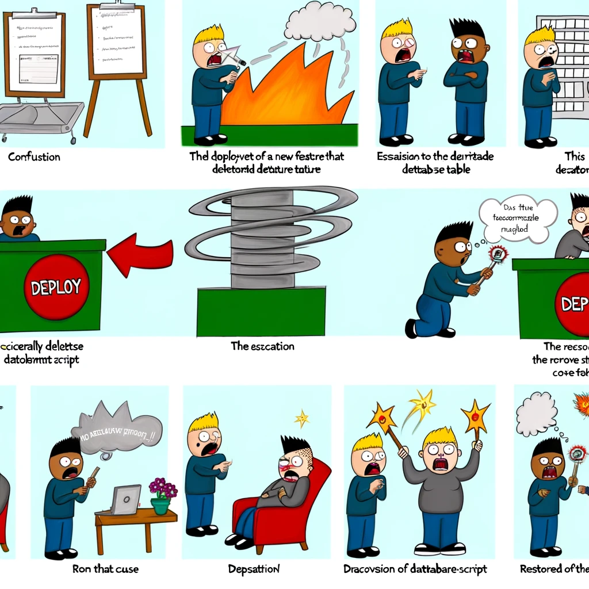
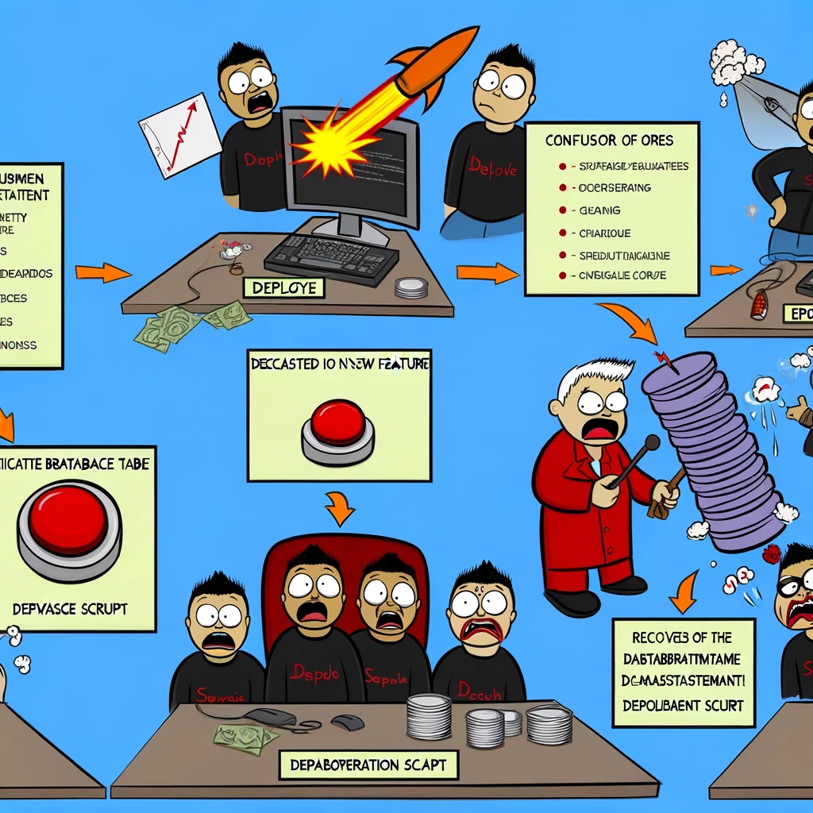

# Postmortem for Incident on January 20, 2024

## Incident Overview
- **Date and Time:** January 20, 2024, from 2:00 PM to 4:30 PM
- **Duration:** 2 hours 30 minutes
- **Impact:** A significant outage affecting our main web application, resulting in 100% unavailability for all users globally.

## Incident Description
During a routine deployment of a new feature intended to enhance user experience, a misconfiguration in the deployment script led to the accidental deletion of a critical database table. This error caused the main application to fail, preventing user access and data retrieval, effectively bringing down the service for the duration of the incident.

## Detection and Response
The issue was first detected by our monitoring system, which alerted the DevOps team to unusual downtime and errors in database operations. Initial investigations focused on potential network issues or hardware failures, leading to a temporary misdirection of efforts. After escalating the incident to our database management team, the root cause was identified, and steps were taken to restore the missing data from backups and fix the deployment script.

## Root Cause and Resolution
- **Root Cause:** A missing validation step in the deployment script allowed an incorrect command to be executed, resulting in the deletion of the database table.
- **Resolution:** The database was restored from the most recent backup, and the deployment script was corrected to include validation checks preventing such errors.

## Corrective and Preventative Measures
To prevent similar incidents, we have identified the following measures:
- **Immediate Fixes:** Patched the deployment script to include several layers of validation before executing database modifications.
- **Long-term Improvements:**
  - Implement a more robust code review process for scripts affecting production environments.
  - Enhance our monitoring system to detect and alert on database integrity issues more effectively.
  - Schedule regular training sessions for the engineering team on best practices in deployment and database management.
  - Establish a more rigorous backup and disaster recovery plan to reduce recovery time in future incidents.

## Conclusion
While this incident caused significant disruption to our service, it has provided us with valuable insights into areas of our deployment and monitoring processes that require improvement. We are committed to implementing the corrective measures outlined above to prevent recurrence and to ensure our service remains reliable and resilient.

## Humorous Diagram
To add a bit of levity and provide a visual representation of the incident, here's a humorous diagram illustrating the key moments from the deployment mishap to the resolution.

